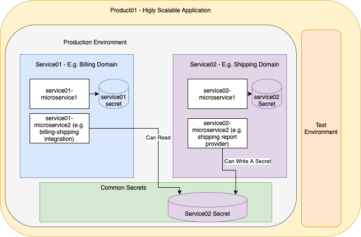

# Architecture Overview
This configuration architeture is an exampe
of a higly scalable approach for secrets management in a company
with multiple software products, each consisting of multiple domains with 
a set of microservices.



A "product" is a high level abstraction over a company application.
For example it is a food delivery software platform.
The platform has a separation to service "domains". 

For example service01 is a billing domain and service02 is a shipping domain.
Different teams are responsible managing those domains.

Core benefit of such architecture, is that with minimal effort a collaborative 
environment can be set where each team can manage own infrastructure and own sercret and
follow the company standard to share some of the secrets (e.g. API tokens for cross-service integration) with other 
domains in the product.

# Apply the test Vault configuration
Go to vault-config
```
cd vault-config
```

Export needed environment variables
```
export VAULT_ADDR=https://vault.ss-ops.com:8200
export VAULT_TOKEN=XXXX
export VAULT_CACERT=/path/to/ca/cert
```
Initit and apply vault configuration
```
terraform init
terraform apply
```
